# Timed Internet Manager for EdgeRouter (TIMER)

This application lets you control Internet access schedules for devices on your network by hiding the firewall rule complexity behind an easy to use web interface. I wrote it primarily for my wife so she could easily modify the schedules as needed, or grant temporary access upon request (*"mom, I have a Zoom meeting with friends, may I have more Internet time please?"*) The responsive interface works well on both desktop and mobile browsers.

The app has been tested on EdgeRouter X v1.10.11. If you try it on a different router model or firmware version and run into issues, please let me know. Also, let me know if it worked well, and I'll add yours to the list of tested devices.

## Prerequisites

### Back up

I recommend you back up your EdgeRouter configuration before proceeding. Although I've been successfully running it for a while, there is no guarantee this application won't break anything for you :)

### Create separate VLAN

Create a separate VLAN with DHCP server for the devices you want to control. In my setup, I have these:

* local network (non-VLAN): switch0, 10.7.7.1/24
  * DHCP server: LAN
* kids network (VLAN 8): switch0.8, 10.7.8.1/24
  * DHCP server: kids

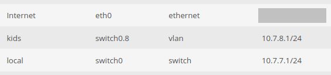


### Create separate wireless network

In UniFi controller, create a separate SSID with VLAN tagging. In my setup, I have `kids` with VLAN 8.

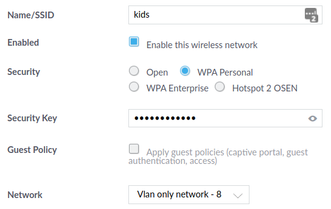

### Create firewall ruleset for outgoing Internet packets

I call mine `WAN_OUT`, and it is set up as follows:

* default action: accept
* interface: eth0, direction: out

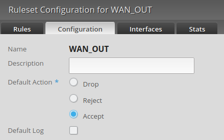

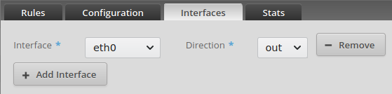


By default, this ruleset allows all outgoing packets to the Internet. The TIMER will add rules to:

1. Allow specific MAC addresses to send packets to the Internet
2. Block all other devices on the specified VLAN

## Installation and configuration

### Authentication

There are two authentication modes:

1. Existing session
   In this mode, the EdgeRouter GUI session cookie will be used. In other words, you need to log into your router's web interface with your credentials.
2. Transparent authentication
   Although not required, I recommend you create a new user account in EdgeRouter GUI (has to be an admin) so you can easily delete or rotate it in the future. You then give these credentials to the app (see the next section) and it will authenticate on your behalf. The advantage of this method is that the end user does not need to know any passwords, and they will only be able to do what TIMER allows them to do. In my use case (my wife controlling access for the kids) I use this method.

### Initial configuration

In `timer.py`, set the following variables:

```
# the firewall ruleset to use
# it needs to be the internet out ruleset, such as WAN_OUT
ruleset  = 'WAN_OUT'

# DHCP server used by the clients you want to block or allow
dhcpSrv  = 'Kids'

# router admin credentials
# if empty, the existing EdgeRouter session will be used
username  = 'timer'
password  = 'strongpassword'
```

### Copy the files

SFTP to EdgeRouter and copy the following files to the new directory `/config/scripts/timer/`:

```
error.tpl
index.tpl
timer.conf
timer.py
```

### Prepare the web server

SSH to EdgeRouter.

Set the permissions:

```
sudo chgrp -R www-data /config/scripts/timer
chmod -R g+r /config/scripts/timer
chmod -R o-rx /config/scripts/timer
chmod ug+x /config/scripts/timer/timer.py
```

Open `/etc/lighttpd/lighttpd.conf` in your favorite text editor (vi FTW!), and add a line for `timer.conf` as follows:

```
include "mime.conf"
include "conf-enabled/10-ssl.conf"
include "conf-enabled/15-fastcgi-python.conf"
include "/config/scripts/timer/timer.conf"
```

### Restart the web server

Kill the server:


```
sudo kill -SIGTERM $(cat /var/run/lighttpd.pid)
```
Restart the server:
```
sudo /usr/sbin/lighttpd -f /etc/lighttpd/lighttpd.conf
```

Or, if you want to run it in **debug mode** in the foreground:
```
sudo /usr/sbin/lighttpd -D -f /etc/lighttpd/lighttpd.conf
```

## Usage

Navigate to `https://youredgerouter/timer`, and you'll see something like this:

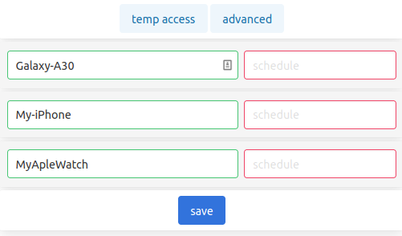

\- OK, what is this?

\- TIMER retrieves known host names from the list of the current DHCP leases.

\- But I definitely have many more devices on my WiFi. Where are they?

\- TIMER doesn't know them *by name* and does not display unnamed devices by default. Click **advanced** to reveal all current leases with the corresponding MAC and IP addresses:

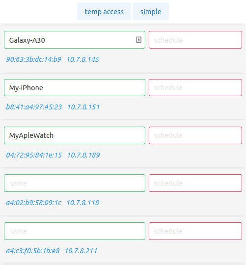

\- This is better, now what?

\- Now you need to name these devices. You can use MAC and IP addresses to identify them. Push the **save** button on the bottom when done. Note that the following characters are not supported: ' " |

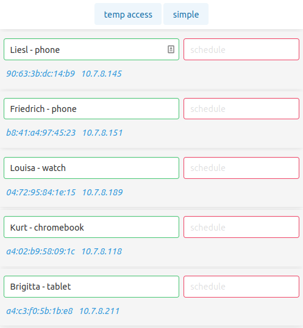

\- OK, the names are set. Now set the schedules, right?

\- Yes. The schedule format is `start1-stop1 [start2-stop2 ...]` where start and stop are the whole hours in 24h format. For example: `8-11 14-16 19-21` will allow Internet access during three time slots: 8-11 in the morning, 2-4 in the afternoon, and 7-9 in the evening.

You can use `*` for **unlimited** access, or leave the schedule empty for **no** Internet access.

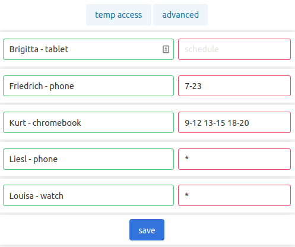

\- I pushed **save** but Liesl's phone and Louisa's watch disappeared from the list

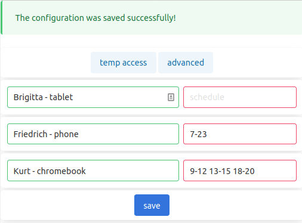

\- This is by design. Once unlimited access is granted, you don't necessarily want to see those devices every time. You can still see them in the advanced list.

\- Oh cool! Now, what is that **temp access** thing?

\- Glad you asked! This is whenever you hear something like *"Dad, I know it's after hours, but if I don't send a Snapchat message to my friend right now, I'm going to die!"* Or your kid's friend visits, and you want to give her temporary access to the Internet. Or you want to install new games on Brigitta's tablet. Just click **temp access**, select the duration, and push **save**

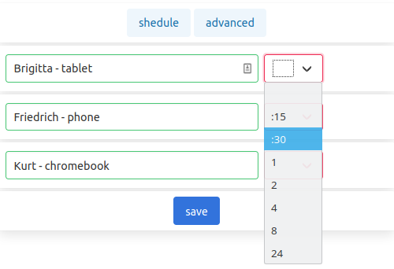

Note: at this point, the application does not display current temporary access rules, but don't worry, they have been added and are active. Speaking of which, see the next section.

## Behind the scenes

Open the ruleset in EdgeRouter GUI and examine its contents:

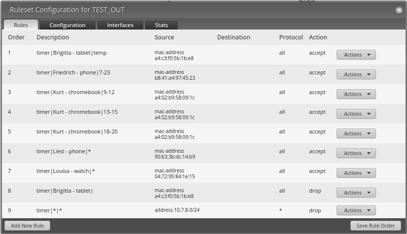

The description consists of three parts: fixed prefix, device name, time slot.

The source is set to the MAC address of the device.

The very last rule is created automatically to drop everything that hasn't explicitly matched.

Feel free to examine each rule.

**WARNING:** DO NOT reorder (drag and drop) rules in the GUI! TIMER uses a range of rule numbers (8000-8999 by default) and reordering will break this completely!

## Future plans

1. Add OUI lookup like [this one](https://www.wireshark.org/tools/oui-lookup.html)
